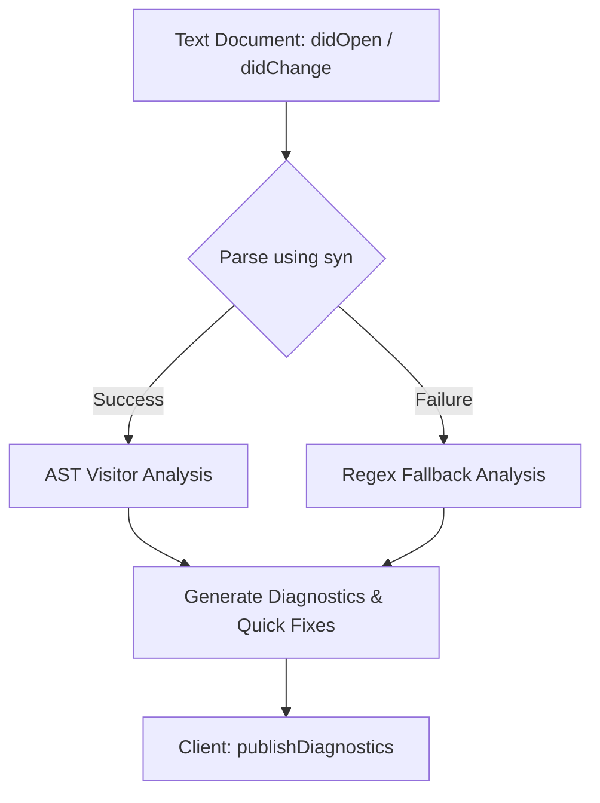

# `wasm4pm-compat-lsp` Architecture

This document defines the layout, capabilities, design decisions, and validations implemented in the Language Server Protocol (LSP) subproject `wasm4pm-compat-lsp`.

---

## 1. Overview and Design Philosophy

The `wasm4pm-compat-lsp` server is a lightweight development assistant designed to enforce the structural invariants and doctrines of `wasm4pm-compat` within standard text editors. It strictly implements the core rules defined in the Product/Architecture Requirements Documents:

1. **Refusal is First-Class (Refusal Law)**: Rejecting a value or process structure must name the specific law violated (e.g., `DanglingEventObjectLink`, `UnsoundWfNet`) rather than using a generic error type or `InvalidInput`.
2. **No Laundering (Format Covenant)**: Crossing format boundaries (e.g., OCEL to XES) must not be done implicitly or silently. A `LossPolicy` must be explicitly declared and a `LossReport` produced.



---

## 2. Directory and Crate Layout

The LSP resides in a dedicated crate root directory parallel to the core library:

```text
/Users/sac/wasm4pm-compat/
├── Cargo.toml                  # Root Cargo manifest
├── docs/
│   └── lsp/
│       └── architecture.md     # This architecture design document
├── src/                        # Core wasm4pm-compat library source code
└── wasm4pm-compat-lsp/         # LSP Subproject Crate
    ├── Cargo.toml              # LSP-specific dependencies
    └── src/
        └── main.rs             # Event loop, CLI parser, AST/Regex validators
```

---

## 3. LSP Event Loop & Lifecycle

The LSP implementation leverages `lsp-max` and runs asynchronously. It supports standard lifecycle events:

- **Initialize / Initialized**: Negotiates server capabilities with the client, advertising support for full document synchronization (`TextDocumentSyncKind::FULL`), code actions, and custom commands.
- **DidOpen / DidChange / DidSave**: Document text changes are stored in an in-memory cache and immediately analyzed to provide real-time diagnostic markers.
- **Shutdown**: Gracefully releases resources, closes listeners, and exits cleanly.

### CLI Options & Transports

The server binary includes a `clap`-based command-line parser supporting:
- **Stdio Mode (`--stdio`)**: Connects via standard input/output. This is the default mode used by most editors (VS Code, Neovim, Helix).
- **TCP Mode (`--port <PORT> --host <HOST>`)**: Starts a TCP listener. Highly useful for debugging and attaching remote instances.
- **Log Level Option (`--log-level <LEVEL>`)**: Configures internal logging via `tracing-subscriber`. Logs are directed to `stderr` to prevent protocol corruption on `stdout`.

---

## 4. Analysis Pipeline

Because source files may contain syntax errors while actively being typed by a developer, the analyzer employs a dual-stage diagnostic pipeline:

1. **Structural AST parsing (`syn`)**: Parsed code is traversed using a `syn::visit::Visit` visitor. This provides precise, semantic checks on Rust constructs.
2. **Fallback pattern scanning (`regex`)**: If the document contains syntax errors and `syn` fails to parse it, the analyzer falls back to a regex-based scanner to continuously highlight policy violations without waiting for successful compilation.

---

## 5. Validate Rules & Diagnostics

### W4PM-001: Refusal Law Violation
- **Trigger**: Detecting occurrences of the token `InvalidInput` in code referencing or defining refusal reasons.
- **Message**: "Refusal Law Violation: Avoid generic error types like `InvalidInput`. Always use a specific named law (e.g., `DanglingEventObjectLink`, `UnsoundWfNet`) to represent structural refusal."
- **Severity**: `Warning`
- **Quick Fix**: Suggest replacing the token with a valid named refusal law (`DanglingEventObjectLink`).

### W4PM-002: Format Covenant Violation
- **Trigger**: Calling format projection or flattening functions (e.g., `flatten_ocel_to_xes`, `.project()`, `.flatten()`) without passing an argument that references `LossPolicy` or `policy`.
- **Message**: "Format Covenant Violation: Lossy projections (like OCEL to XES flattening) must explicitly specify a `LossPolicy` argument."
- **Severity**: `Error`
- **Quick Fix**: Suggest inserting `LossPolicy::AllowLossWithReport` as a starting policy.

---

## 6. Workspace Commands

The LSP exposes custom workspace commands that can be invoked via `workspace/executeCommand` code actions or client menus:

- **`wasm4pm-compat.explainRefusal`**: Takes the name of a refusal law as an argument and displays a popup with its detailed paper-derived meaning.
- **`wasm4pm-compat.listRefusalLaws`**: Lists all canonical refusal laws currently defined by the `wasm4pm-compat` specification.

---

## 7. Dependency Selection

The subproject depends on the following crate ecosystem:
- **`lsp-max`**: High-level, async language server framework (replaces `tower-lsp`; `tokio` is a transitive dependency via `lsp-max`).
- **`clap`**: Declarative command-line options parser.
- **`syn` / `proc-macro2`**: Full Rust AST parsing, walking, and span extraction.
- **`regex`**: Fast pattern matching fallback for invalid/partial source files.
- **`quote`**: Rust code output formatting helper.
- **`wasm4pm-compat`**: The local core process evidence crate itself.
